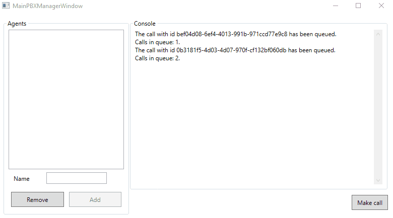

# PBXManagerRecruitmentTask - zadanie rekrutacyjne

Projekt małej centralki telefonicznej opartej na technologi WPF (.Net Framework 4.7). 
Zostały wykorzystane poniższe zewnetrzne zależności:
 - MVVM Light (https://github.com/lbugnion/mvvmlight)

Podgląd mojej implementacji:

Treść zadania:

Aplikacja „Centrala Telefoniczna” symuluje działanie prawdziwej centrali telefonicznej, do której wpadają połączenia w losowych odstępach czasu. Połączenia są kolejkowane i obsługiwane przez agentów. Agent odbiera połączenie, przeprowadza rozmowę, kończy połączenie, odbiera następne połączenie z kolejki.

Wymagania techniczne:
1.	Aplikacja ma być cały czas responsywna, niedopuszczalne jest zamrożenie wątku UI.
2.	Aplikacja ma być wielowątkowa.
3.	UI ma być wykonany w technologii WPF (w przypadku niektórych zadań).
4.	Dopuszczalne jest umieszczenie w kodzie wartości konfiguracyjnych, a nie w pliku app.config
5.	Możliwość niewykorzystywania zaawansowanych mechanizmów walidacji.
6.	Aplikacja nie korzysta z zewnętrznych źródeł danych (DB, web services, pliki)
7.	Długość rozmów z agentami – losowa; odstępy czasu pomiędzy generowanymi połączeniami – losowe.

Obiekty i klasy:
1.	Klasa Agent – ma zawierać właściwość „Name”.
2.	Klasa Call – ma zawierać właściwości: identyfikator połączenia „Id” i  długość rozmowy „DurationInSec”.
3.	Pozostałe klasy i obiekty według własnego uznania.

Zadanie 1.
1.	Aplikacja WPF.
2.	Możliwość dodawania i usuwania agentów.
3.	Wyświetlanie dostępnych agentów.
4.	Dodawanie i usuwanie agentów jest logowane na konsoli centralnej.
5.	Aplikacja w losowych odstępach czasu generuje połączenia. Generowane połączenia są logowane na konsoli centralnej.
6.	Połączenia są kolejkowane.
7.	Po wygenerowaniu połączenia na konsoli należy wyświetlić liczbę zakolejkowanych połączeń.
8.	Należy przewidzieć przycisk „Dodaj połączenie” - po naciśnięciu którego jest generowane i kolejkowane połączenie.
9.	Każdy agent pobiera połączenie z kolejki, przeprowadza rozmowę (długość rozmowy jest losowa), kończy rozmowę, pobiera kolejne połączenie z kolejki.

